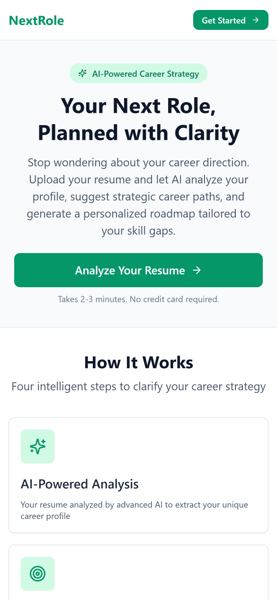
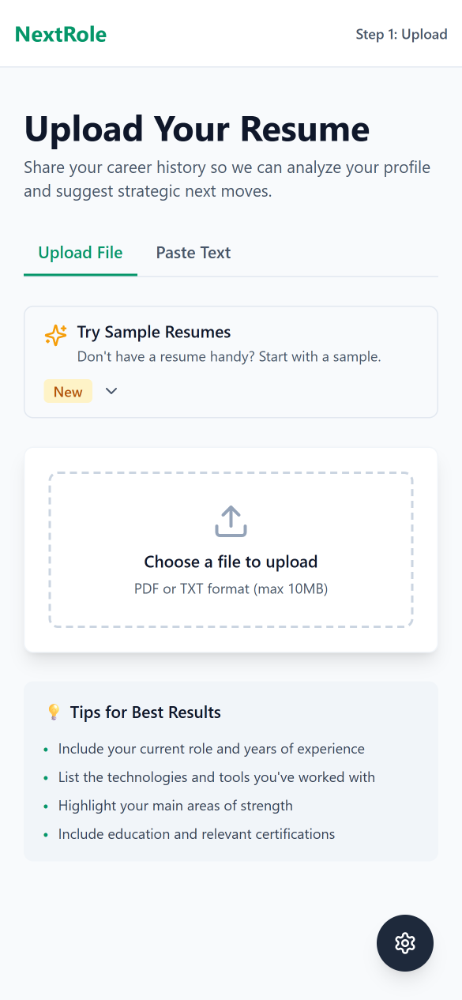
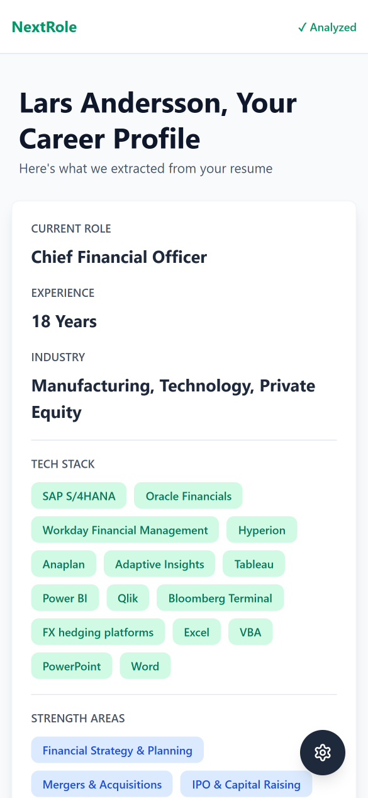
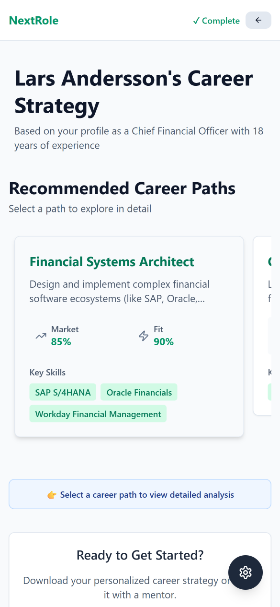
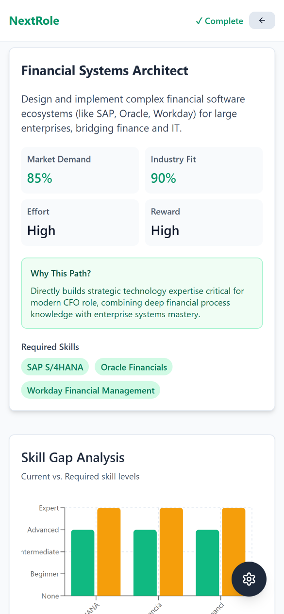

# Features Overview

## Core Pages

### 1. **Landing Page** (`/`)
- Clear value proposition with 4 key features highlighted
- CTA button: "Get Started" → leads to resume upload
- Feature overview with icons and descriptions:
  - AI-Powered Analysis
  - Strategic Paths
  - Skill Gaps
  - Actionable Roadmap
- Professional, minimal Tailwind-based design
- Responsive navigation header with branding

### 2. **Resume Upload** (`/upload`)
- **Two input methods:**
  - Paste resume text directly
  - Upload PDF, TXT, or DOCX files (auto-extracts text)
- **Real-time preview** of extracted profile:
  - Name, current role, years of experience
  - Tech stack (searchable/filterable)
  - Strength areas
  - Industry background
  - Optional: Certifications, Education
- **Manual editing capability** for corrections
- **Validation feedback** for incomplete data
- **Sample resumes** available for quick testing:
  - Entry-level marketing
  - Mid-level software engineer
  - Executive finance
  - Senior healthcare professional

After uploading, the system extracts and displays the career profile:

### 3. **Career Strategy Dashboard** (`/dashboard`)
Main analysis page with multiple sections:

#### A. Career Paths Section (Carousel)

- **Minimal paths display** for fast loading
- Horizontal carousel showing 4-6 options
- Per-path card displays:
  - Role name and brief description
  - Market demand score (0-100)
  - Industry alignment score (0-100)
  - Key required skills preview
- **Click to select** a path for detailed analysis
- Smooth transitions and responsive design

#### B. Detailed Path Section

- Appears after selecting a path
- Shows complete information:
  - Full description and reasoning
  - Market demand and effort level
  - Reward potential (career growth/salary)
  - Complete required skills list
  - Industry alignment analysis

#### C. Skill Gap Analysis
- **Interactive visualization:**
  - Bar chart showing skill gaps
  - Current level vs. required level
  - Color-coded importance levels
  - Hover details for each skill
- **Per-skill breakdown:**
  - Skill name and proficiency level
  - Importance (Low/Medium/High)
  - Gap severity (0-100)
  - Learning resources and links
- **Quick wins** - skills that can be learned quickly
- **Overall gap score** and timeline estimate

#### D. Career Roadmap
- **Timeline visualization** (month-by-month)
- **Customizable duration** (3-24 months)
- Each month includes:
  - Focus areas and key skills
  - Specific action items to complete
  - Project ideas for hands-on learning
  - Milestones to track progress
  - Recommended resources
- **Success metrics** section
- **Risk factors** with mitigation strategies
- **Support resources** (mentorship, courses, communities)

### 4. **Settings & API Mode Toggle**
- **API Mode Selection:** Mock mode (for testing) or Real mode (calls actual AI APIs)
- **AI Provider Selection:** Gemini (default) or Deepseek (alternative)
- **Persistent settings** across page navigations

## User Journey

1. User lands on homepage and learns about NextRole's value
2. User chooses to "Get Started"
3. User uploads resume (PDF or text) or pastes text directly
4. System extracts and displays career profile with preview
5. User confirms/edits profile data
6. System generates 4-6 possible career paths (carousel view)
7. User selects path of interest
8. System loads detailed path information with skill gap analysis
9. System analyzes skill gaps for that path with visualization
10. System generates personalized month-by-month roadmap
11. User can explore metrics, risks, and resources
12. User can switch providers or use mock data for testing
